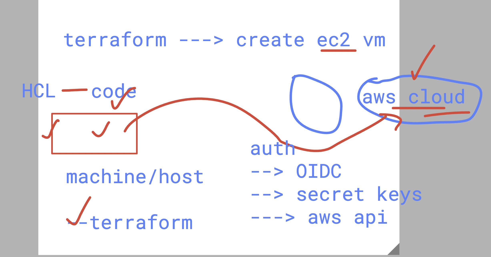

# Infra Problem in Past Days


### Verify Terraform Installation

```bash
[ec2-user@ip-172-31-16-77 ~]$ terraform version
Terraform v1.14.0
on linux_amd64
```

### Creating Code Directory Structure

```bash
[ec2-user@ip-172-31-16-77 ~]$ mkdir ashu-project
[ec2-user@ip-172-31-16-77 ~]$ ls
ashu-project
[ec2-user@ip-172-31-16-77 ~]$ mkdir -p ashu-project/day1
[ec2-user@ip-172-31-16-77 ~]$ mkdir -p ashu-project/day2
[ec2-user@ip-172-31-16-77 ~]$ mkdir -p ashu-project/day3
[ec2-user@ip-172-31-16-77 ~]$ tree ashu-project/
ashu-project/
├── day1
├── day2
└── day3

3 directories, 0 files
```

## Executing Terraform Code -- Process

```bash
[ec2-user@ip-172-31-16-77 ashu-project]$ ls
day1  day2  day3
[ec2-user@ip-172-31-16-77 ashu-project]$ cd day1/
[ec2-user@ip-172-31-16-77 day1]$ ls
hello.tf
[ec2-user@ip-172-31-16-77 day1]$ terraform init
Initializing the backend...
Initializing provider plugins...

Terraform has been successfully initialized!

You may now begin working with Terraform. Try running "terraform plan" to see
any changes that are required for your infrastructure. All Terraform commands
should now work.

If you ever set or change modules or backend configuration for Terraform,
rerun this command to reinitialize your working directory. If you forget, other
commands will detect it and remind you to do so if necessary.
[ec2-user@ip-172-31-16-77 day1]$ terraform plan

Changes to Outputs:
    + hello  = "Hello world from terraform"
    + hello1 = "Hello world from terraform by ashutoshh"

You can apply this plan to save these new output values to the Terraform state, without changing any real infrastructure.

──────────────────────────────────────────────────────────────────────────────────────────────────────────────────────────────────────

Note: You didn't use the -out option to save this plan, so Terraform can't guarantee to take exactly these actions if you run
"terraform apply" now.
[ec2-user@ip-172-31-16-77 day1]$ terraform apply

Changes to Outputs:
    + hello  = "Hello world from terraform"
    + hello1 = "Hello world from terraform by ashutoshh"

You can apply this plan to save these new output values to the Terraform state, without changing any real infrastructure.

Do you want to perform these actions?
    Terraform will perform the actions described above.
    Only 'yes' will be accepted to approve.

    Enter a value: yes

Apply complete! Resources: 0 added, 0 changed, 0 destroyed.

Outputs:

hello = "Hello world from terraform"
hello1 = "Hello world from terraform by ashutoshh"
```

### terraform machine -- can connect AWS Cloud using many ways 




### https://registry.terraform.io/providers/hashicorp/aws/latest

### terraform more commands

```
395  terraform  init 
  396  ls 
  397  ls -a
  398  terraform plan 
  399  terraform apply 
```
