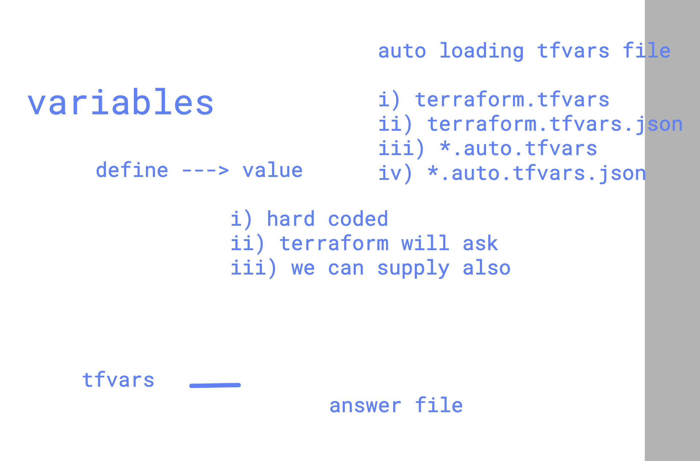
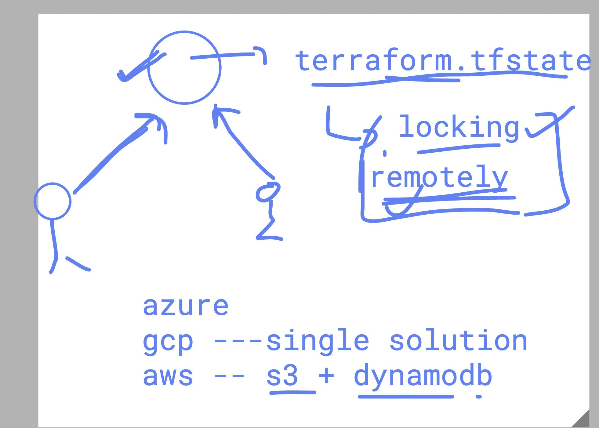
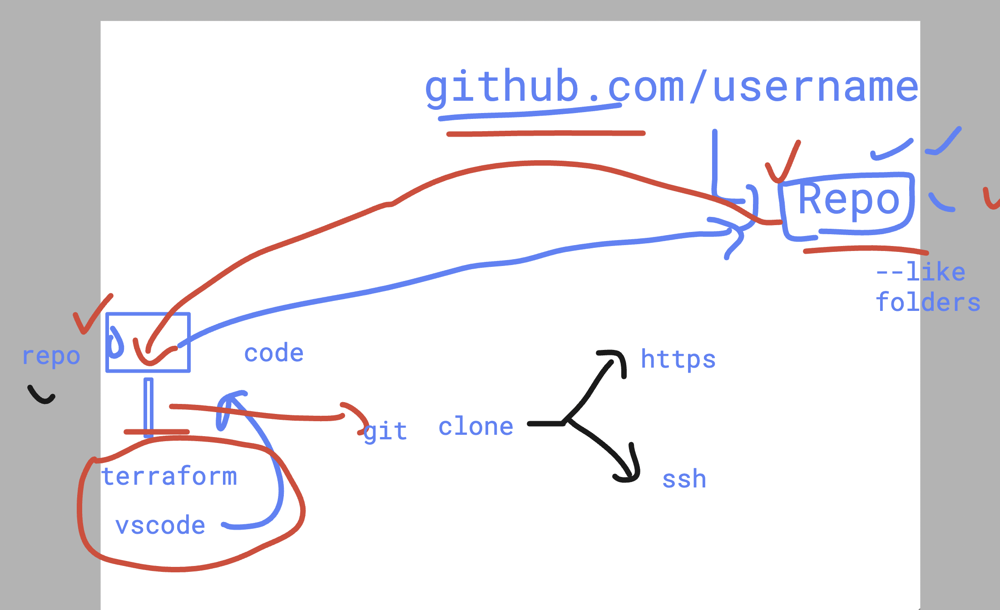

# Terraform Day 2

## Checking few details

```bash
ec2-user@ip-172-31-16-77 ashu-project]$ ls
day1  day2  day3
[ec2-user@ip-172-31-16-77 ashu-project]$ cd day2
[ec2-user@ip-172-31-16-77 day2]$ ls
ec2.tf  provider.tf
[ec2-user@ip-172-31-16-77 day2]$ terraform init
Initializing the backend...
Initializing provider plugins...
- Finding hashicorp/aws versions matching "6.27.0"...
- Installing hashicorp/aws v6.27.0...
- Installed hashicorp/aws v6.27.0 (signed by HashiCorp)
Terraform has created a lock file .terraform.lock.hcl to record the provider
selections it made above. Include this file in your version control repository
so that Terraform can guarantee to make the same selections by default when
you run "terraform init" in the future.

Terraform has been successfully initialized!

You may now begin working with Terraform. Try running "terraform plan" to see
any changes that are required for your infrastructure. All Terraform commands
should now work.

If you ever set or change modules or backend configuration for Terraform,
rerun this command to reinitialize your working directory. If you forget, other
commands will detect it and remind you to do so if necessary.
[ec2-user@ip-172-31-16-77 day2]$ ls
ec2.tf  provider.tf
[ec2-user@ip-172-31-16-77 day2]$ ls -a
.  ..  .terraform  .terraform.lock.hcl  ec2.tf  provider.tf
[ec2-user@ip-172-31-16-77 day2]$ tree .terraform
.terraform
└── providers
    └── registry.terraform.io
        └── hashicorp
            └── aws
                └── 6.27.0
                    └── linux_amd64
                        ├── LICENSE.txt
                        └── terraform-provider-aws_v6.27.0_x5

6 directories, 2 files
```

## Checking with fmt and validate

```bash
ec2-user@ip-172-31-16-77 day2]$ ls
ec2.tf  provider.tf
[ec2-user@ip-172-31-16-77 day2]$ terraform fmt
provider.tf
[ec2-user@ip-172-31-16-77 day2]$ terraform validate
Success! The configuration is valid.

[ec2-user@ip-172-31-16-77 day2]$ terraform validate
╷
│ Error: Missing required argument
│
│   with aws_instance.example,
│   on ec2.tf line 1, in resource "aws_instance" "example":
│    1: resource "aws_instance" "example" {
│
│ "ami": one of `ami,launch_template` must be specified
╵
[ec2-user@ip-172-31-16-77 day2]$ terraform validate
Success! The configuration is valid.
```

### Update output

```bash
terraform apply
terraform output

ashu-vm-id = "i-04d5555cdd4cbef48"
ashu-vm-publicIP = "44.193.39.58"
```

### Terraform variable supply options

```bash
487  terraform plan
488  terraform plan -var vm-name=ashutoshh-new-vm
489  history
490  terraform apply
491  history
492  terraform apply -var vm-name=ashutoshh-new-vm
```
### terraform tfvars autoloading file for variable values



### few more terraform commands

```
 492  terraform apply  -var vm-name=ashutoshh-new-vm 
  493  history 
  494  terraform apply  -var vm-name=ashutoshh-new-vm  
  495  history 
  496  terraform plan  -var-file ashu-values.tfvars 
  497  history 
  498  terraform plan  -var-file=ashu-values.tfvars 
  499  terraform plan  -var-file="ashu-values.tfvars" 
  500  history 
  501  terraform plan  -var-file  stage.tfvars 
  502  history 

```

### terraform tfstate storing it remotely 



### some basic github repo operations 

### clone repo 

```
git   clone https://github.com/redashu/boa-ashu-8thjan2026.git 
Cloning into 'boa-ashu-8thjan2026'...
remote: Enumerating objects: 3, done.
remote: Counting objects: 100% (3/3), done.
remote: Total 3 (delta 0), reused 0 (delta 0), pack-reused 0 (from 0)
Receiving objects: 100% (3/3), done.
[ec2-user@ip-172-31-16-77 ashu-project]$ ls
boa-ashu-8thjan2026  day1  day2  day3
[ec2-user@ip-172-31-16-77 ashu-project]$ 

```

## Understanding clone 




### copy code to local repo 

```
[ec2-user@ip-172-31-16-77 ashu-project]$ ls
boa-ashu-8thjan2026  day1  day2  day3
[ec2-user@ip-172-31-16-77 ashu-project]$ 
[ec2-user@ip-172-31-16-77 ashu-project]$ 
[ec2-user@ip-172-31-16-77 ashu-project]$ ls  day2/
ashu-values.tfvars  outputs.tf   stage.tfvars              terraform.tfvars
ec2.tf              provider.tf  terraform.tfstate.backup  varirables.tf
[ec2-user@ip-172-31-16-77 ashu-project]$ 
[ec2-user@ip-172-31-16-77 ashu-project]$ cp day2/*.tf   boa-ashu-8thjan2026/
[ec2-user@ip-172-31-16-77 ashu-project]$ 
[ec2-user@ip-172-31-16-77 ashu-project]$ 
[ec2-user@ip-172-31-16-77 ashu-project]$ cp day2/terraform.tfvars   boa-ashu-8thjan2026/
[ec2-user@ip-172-31-16-77 ashu-project]$ 

```
