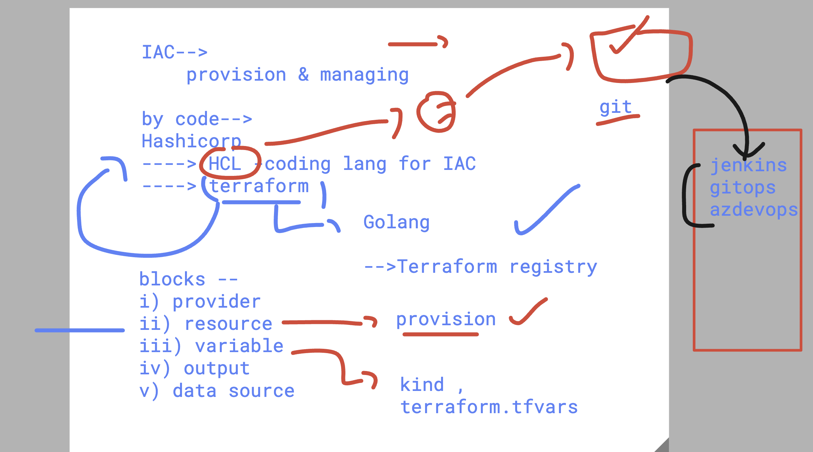

### Revision 



### updated basic change to git repo 

```
ec2-user@ip-172-31-16-77 ashu-project]$ ls
boa-ashu-8thjan2026  day1  day2  day3

[ec2-user@ip-172-31-16-77 ashu-project]$ cd boa-ashu-8thjan2026/

[ec2-user@ip-172-31-16-77 boa-ashu-8thjan2026]$ ls
README.md  ec2.tf  outputs.tf  provider.tf  terraform.tfvars  varirables.tf

[ec2-user@ip-172-31-16-77 boa-ashu-8thjan2026]$ git status
On branch master
Your branch is up to date with 'origin/master'.

Changes not staged for commit:
  (use "git add <file>..." to update what will be committed)
  (use "git restore <file>..." to discard changes in working directory)
        modified:   terraform.tfvars


no changes added to commit (use "git add" and/or "git commit -a")
[ec2-user@ip-172-31-16-77 boa-ashu-8thjan2026]$ git add .

[ec2-user@ip-172-31-16-77 boa-ashu-8thjan2026]$ git commit  -m "vm name change"
[master 249c1f9] vm name change
 Committer: EC2 Default User <ec2-user@ip-172-31-16-77.ec2.internal>
Your name and email address were configured automatically based
on your username and hostname. Please check that they are accurate.
You can suppress this message by setting them explicitly. Run the
following command and follow the instructions in your editor to edit
your configuration file:

    git config --global --edit

After doing this, you may fix the identity used for this commit with:

    git commit --amend --reset-author

 1 file changed, 1 insertion(+), 1 deletion(-)
 
[ec2-user@ip-172-31-16-77 boa-ashu-8thjan2026]$ git  push 
Enumerating objects: 5, done.
Counting objects: 100% (5/5), done.
Delta compression using up to 4 threads
Compressing objects: 100% (3/3), done.
Writing objects: 100% (3/3), 325 bytes | 325.00 KiB/s, done.
Total 3 (delta 1), reused 0 (delta 0), pack-reused 0 (from 0)
remote: Resolving deltas: 100% (1/1), completed with 1 local object.
To https://github.com/redashu/boa-ashu-8thjan2026.git
   6561f00..249c1f9  master -> master
[ec2-user@ip-172-31-16-77 boa-ashu-8thjan2026]$ 

```